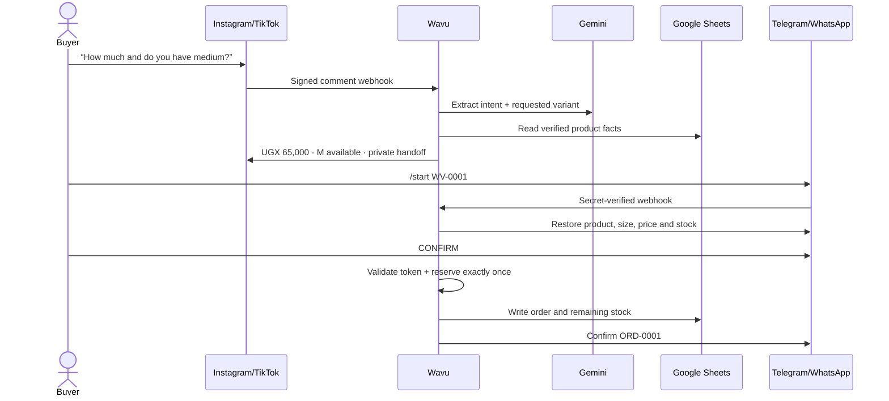

<div align="center">
  
  <h1>Wavu</h1>
  <p><strong>Turn overlooked social comments into verified customers.</strong></p>
  <p>
    <a href="https://wavu-974284691016.africa-south1.run.app/"><strong>Live demo</strong></a>
    ·
    <a href="#two-minute-demo"><strong>Two-minute demo</strong></a>
    ·
    <a href="#reliability-is-a-product-feature"><strong>Reliability proof</strong></a>
  </p>
  <p>
    
    
    
    
  </p>
</div>

> A customer asking “how much?” is not engagement. It is a sale waiting for an answer.

Wavu is an AI agent for small social-commerce businesses. It finds genuine buying intent inside noisy Instagram and TikTok comment streams, answers with merchant-approved facts, carries the buyer into a private Telegram or WhatsApp conversation without losing context, reserves stock safely, and writes the outcome to Google Sheets.

This is not a generic chatbot with arbitrary integrations. Each application owns a necessary part of the real transaction: **discovery happens on social media, product truth lives in the merchant's catalogue, trust and details move to private chat, and the resulting order must return to the merchant's operational record.**

## Submission links

| Deliverable | Link |
|---|---|
| Working project | **[Open the live Wavu agent](https://wavu-974284691016.africa-south1.run.app/)** |
| Source repository | **[github.com/NestroyMusoke/Wavu](https://github.com/NestroyMusoke/Wavu)** |
| Two-minute demo video | **TODO before submission: paste the public video link here** |
| Health proof | [`/health`](https://wavu-974284691016.africa-south1.run.app/health) |
| Connected-app proof | [`/api/integrations`](https://wavu-974284691016.africa-south1.run.app/api/integrations) |
| Independent outcome evaluation | [`/api/evaluate`](https://wavu-974284691016.africa-south1.run.app/api/evaluate) |

> **Submission owner:** replace the video TODO with the final public two-minute demo URL before the 4:00 PM Pacific deadline. Everything else above is public and judge-accessible.

## Why this problem matters

Across Uganda, Kenya and many other African markets, a social page is often the storefront. The same owner may be serving a customer in person, answering WhatsApp calls, checking stock, arranging delivery and trying to notice purchase questions buried beneath reactions and unrelated comments.

Missing one or two buyers may look small in a global dashboard. For a young local business, recovering one or two additional sales every day can mean **30–60 more customer opportunities per month**. That can affect rent, restocking, an employee's pay and whether the business survives long enough to grow.

### This problem is observed, not invented

The image below was supplied from a real TikTok comment section. Buyers are asking for a particular phone, storage capacity, accessories, used devices, swaps and prices. Each short line contains different product context and a different potential transaction—and each waits beside dozens of other comments.

<p align="center">
  
</p>

<p align="center"><em>Real public social-commerce enquiries: product requests and price questions mixed into one comment stream. Usernames are incidental public context; Wavu does not require or infer their private information.</em></p>

Wavu's founder also operates a business TikTok channel (kept private here) and has personally watched potential customers disappear because their questions were answered late or not at all. Wavu started from that lived operational failure—not from a requirement to connect three APIs.

The broader market evidence agrees. The GSMA's 2023 study surveyed more than 1,500 e-commerce MSMEs across six African markets. It found that a majority of MSMEs in the study sold online exclusively through social media, often informally. Among MSMEs using social commerce, reported platform use included Facebook by 90% of small firms, WhatsApp by 80%, Instagram by 47% and TikTok by 25%. The report also describes the coordination burden: sellers frequently have to arrange price, payment and delivery individually outside an integrated storefront.

Sources: [GSMA — E-commerce in Africa: Unleashing the Opportunity for MSMEs](https://www.gsma.com/solutions-and-impact/connectivity-for-good/mobile-for-development/wp-content/uploads/2023/10/E-CommerceInAfrica_R_WebSingles.pdf) and [GSMA research summary](https://www.gsma.com/solutions-and-impact/connectivity-for-good/mobile-for-development/blog/what-challenges-do-african-msmes-face-in-adopting-e-commerce/).

We deliberately do **not** claim that “90% of all African businesses use TikTok or Instagram.” The defensible claim is more useful: social commerce is already a primary online-sales path for many surveyed African MSMEs, and the work of joining comments, private conversations, stock and delivery remains fragmented.

## Why the name *Wavu*

**Wavu** means “net” in Swahili and can also extend to the internet. A net connects separate points—and catches what would otherwise slip through. Wavu connects the scattered surfaces of a social sale and catches valuable buying intent before it disappears beneath the next thousand comments.

The name is regional, memorable and functional: Wavu is the coordination net between public attention and completed service.

Dictionary reference: [TUKI English–Swahili entry for “net”](https://swahili-dictionary.com/english-swahili/net_net).

## What Wavu does

1. Receives a signed Instagram or TikTok comment event.
2. Separates buying intent from reactions, spam and noise.
3. Extracts the requested product, variant and question type.
4. Grounds price, availability and location in the merchant's Google Sheet.
5. Publishes a concise answer without allowing the model to invent commercial facts.
6. Creates a short-lived opaque `WV-XXXX` handoff token.
7. Moves the buyer into a private Telegram or WhatsApp conversation with context intact.
8. Confirms the product, variant and price before any stock mutation.
9. Reserves inventory exactly once and prevents the last item being sold twice.
10. Mirrors the order, handoff and audit trail back to Google Sheets.

## External apps used

| External app | Why it is necessary | What the live build proves |
|---|---|---|
| **Instagram Graph API** | Customers discover products and ask public questions here. | Connected business account, signed Meta webhook receiver, comment parsing and reply adapter. |
| **Telegram Bot API** | Serious buyers continue privately without exposing phone/address details in comments. | Real outbound delivery, signed inbound webhook, deep-link handoff, chat-session context restoration and confirmation. |
| **Google Sheets API** | A familiar source of truth for merchants without an ERP or e-commerce site. | Live catalogue import plus Products, Orders, Handoffs and Events synchronization. |
| **Google Vertex AI / Gemini** | Interprets informal, multilingual and incomplete buyer language. | Live model-backed intent extraction with deterministic fallback. |
| **TikTok for Business API** | TikTok is an important discovery surface for the target merchant. | Production-shaped adapter, signature verification, parsing, reply and polling paths; live credential activation remains optional. |
| **WhatsApp Cloud API** | The intended default private channel for many African merchants. | Adapter and webhook path are implemented; Telegram is the fully live demo bridge while Meta number activation is pending. |

Cloud Run and Secret Manager host and protect the system; they are infrastructure rather than applications counted to inflate the multi-app total.

## Architecture

```mermaid
flowchart LR
    C[Customer] -->|public question| IG[Instagram / TikTok]
    IG -->|signed webhook| GW[Webhook gateway]
    GW --> DEDUPE[Idempotency guard]
    DEDUPE --> AI[Gemini intent extraction]
    AI --> POLICY[Deterministic policy engine]
    SHEETS[(Google Sheets catalogue)] -->|price · stock · location| POLICY
    POLICY -->|grounded public answer| IG
    POLICY -->|opaque WV token| HANDOFF[Context handoff]
    HANDOFF --> TG[Telegram / WhatsApp]
    TG -->|signed private message| RESERVE[Reservation engine]
    RESERVE -->|exactly-once order| LEDGER[(Order + audit ledger)]
    RESERVE -->|stock update| SHEETS
    LEDGER --> EVAL[Independent evaluator]
    EVAL --> UI[Live proof dashboard]
```



### One buyer journey



## Engineering decisions that matter

### The model interprets; deterministic code authorizes

Gemini can classify a messy sentence, but it cannot choose a price, invent availability or decrement inventory. Those operations are grounded in catalog data and enforced by deterministic domain code. If the model fails, Wavu falls back to a conservative rules-based classifier. If product truth cannot be verified, Wavu asks for clarification or escalates to a human.

### Context survives the application boundary

The public response contains an opaque, expiring `WV-XXXX` token—not customer details. A Telegram deep link carries that token into the bot. The inbound webhook binds it to the current chat, allowing a later `CONFIRM` message to recover the exact source post, comment, product, size and price.

### Webhooks are treated as hostile input

- Meta payloads require an HMAC-SHA256 signature when the app secret is configured.
- TikTok signatures include HMAC verification and timestamp-freshness enforcement.
- Telegram supplies a private webhook secret that Wavu compares in constant time.
- The demonstration bot accepts transactions only from its approved chat ID.
- Tokens and platform credentials live in Google Secret Manager, never in Git.

### Retries cannot quietly create duplicate orders

Social comment IDs are idempotency keys. A repeated comment event reuses its original result instead of generating a second handoff. A consumed handoff points to one order; subsequent confirmations return that order rather than decrementing stock again.

### The demo refuses to oversell

The final unit can be reserved only after explicit confirmation. A competing buyer receives an accurate sold-out response and no order is created. The hackathon deployment is deliberately capped at one Cloud Run instance so its synchronous reservation boundary remains safe for the demo. Production hardening would move the same invariant into a Firestore transaction before horizontal scaling.

## Reliability is a product feature

Run the complete test suite:

```bash
npm test
```

Current result: **17 tests passed, 0 failed**.

| Failure or risk | Control | Proof |
|---|---|---|
| Model hallucinates price or stock | Commercial facts are read from the catalogue after classification. | Grounding test + price-origin runtime assertion. |
| Gemini is unavailable | Conservative deterministic classifier takes over. | AI fallback test. |
| Platform retries a webhook | Comment IDs and consumed handoffs are idempotent. | Duplicate-comment and duplicate-confirmation tests. |
| Two buyers request the final unit | Reservation code checks and mutates stock in one synchronous boundary. | Scarce-stock concurrency test. |
| Forged Meta/TikTok event | Cryptographic signature and freshness checks. | Webhook-signature tests. |
| Forged Telegram event | Constant-time webhook-secret validation and chat allowlist. | Telegram secret test + live webhook configuration. |
| Product cannot be verified | Wavu asks instead of guessing. | Unknown-product test. |
| Spreadsheet/API temporarily fails | In-memory state continues and reports degraded connection status. | Adapter tests and visible health state. |
| Hidden corruption | Six independent invariants evaluate live state. | [`/api/evaluate`](https://wavu-974284691016.africa-south1.run.app/api/evaluate). |

### Runtime invariants

The evaluator is separate from the workflow that creates orders. It checks:

1. Inventory never becomes negative.
2. Every order references an existing handoff.
3. Every consumed handoff references an order.
4. No handoff creates multiple orders.
5. Every order price came from the catalogue.
6. Every order traces back to a real source comment.

The dashboard exposes these checks as **6/6**, and the JSON evidence is public at [`/api/evaluate`](https://wavu-974284691016.africa-south1.run.app/api/evaluate).

## Two-minute demo

**Video:** TODO — add the public two-minute video URL before submission.

Recommended live sequence:

| Time | Action | What it proves |
|---:|---|---|
| 0:00–0:15 | Show the real comment screenshot and state the founder problem. | Usefulness and lived need. |
| 0:15–0:35 | Click **Buyer asks price + size**. | Gemini extraction plus grounded price and stock. |
| 0:35–0:45 | Click **Noise arrives**. | Wavu does not spam every commenter. |
| 0:45–1:00 | Click **High-value buyer**. | Human escalation for consequential requests. |
| 1:00–1:25 | Open the Telegram deep link, send `/start WV-…`, then `CONFIRM`. | Real cross-app context restoration and action. |
| 1:25–1:40 | Show Telegram confirmation and Google Sheets order. | External side effect and merchant-visible record. |
| 1:40–1:52 | Run the scarce-stock second-buyer case. | Overselling protection. |
| 1:52–2:00 | Point to **6/6 outcome checks** and close with the recovered-customer impact. | Reliability, not a happy-path illusion. |

Suggested closing line:

> Wavu does not ask a small business owner to watch four apps harder. It joins those apps into one reliable customer-service workflow, so fewer livelihoods slip through the comments.

## Run locally

### Prerequisites

- Node.js 20 or newer
- No package installation is currently required
- External credentials are optional; without them Wavu uses safe local demo adapters

```bash
git clone https://github.com/NestroyMusoke/Wavu.git
cd Wavu
cp .env.example .env
npm test
npm start
```

Open [http://localhost:8787](http://localhost:8787).

### Environment configuration

Copy `.env.example` to `.env` and configure only the integrations you want:

| Variable | Purpose |
|---|---|
| `PUBLIC_BASE_URL` | Public HTTPS origin used in handoffs and webhook registration. |
| `META_ACCESS_TOKEN` | Instagram Graph API access token. |
| `INSTAGRAM_ACCOUNT_ID` | Connected Instagram professional account. |
| `META_APP_SECRET` | Verifies Meta webhook signatures. |
| `TELEGRAM_BOT_TOKEN` | BotFather token; store as a secret in production. |
| `TELEGRAM_CHAT_ID` | Optional demo allowlist. |
| `TELEGRAM_BOT_USERNAME` | Generates `t.me` handoff links. |
| `TELEGRAM_WEBHOOK_SECRET` | Verifies that inbound Telegram calls are genuine. |
| `GOOGLE_SHEET_ID` | Merchant catalogue and operational workbook. |
| `GOOGLE_SERVICE_ACCOUNT_FILE` | Local-only path to service-account JSON. |
| `GOOGLE_CLOUD_PROJECT` | Enables Vertex AI through application-default identity. |
| `VERTEX_MODEL` | Gemini model used for intent extraction. |

Never commit `.env`, tokens or service-account files. The repository's `.gitignore` and `.dockerignore` exclude them.

### Google Sheets

1. Create a Google Cloud service account with access only to the required APIs.
2. Share the merchant spreadsheet with the service-account email.
3. Start with the `Products` columns represented in `data/seed.json`.
4. Run `node scripts/configure-google-sheet.js` if you want Wavu to create/format the operational tabs.
5. Configure `GOOGLE_SHEET_ID` and local credentials, or use the Cloud Run service identity in production.

Wavu manages four merchant-readable tabs: `Products`, `Orders`, `Handoffs` and `Events`.

### Webhook endpoints

| Platform | Public endpoint | Verification |
|---|---|---|
| Meta / Instagram / WhatsApp | `GET/POST /webhooks/meta` | Challenge token + `X-Hub-Signature-256` HMAC |
| Telegram | `POST /webhooks/telegram` | `X-Telegram-Bot-Api-Secret-Token` |
| TikTok | `GET/POST /webhooks/tiktok` | Challenge + HMAC/timestamp signature |

When `PUBLIC_BASE_URL`, `TELEGRAM_BOT_TOKEN` and `TELEGRAM_WEBHOOK_SECRET` are configured, Wavu registers its Telegram webhook automatically during startup.

### Deploy to Cloud Run

```bash
gcloud run deploy wavu \
  --project YOUR_PROJECT_ID \
  --region YOUR_REGION \
  --source . \
  --service-account YOUR_RUNTIME_SERVICE_ACCOUNT \
  --set-secrets TELEGRAM_BOT_TOKEN=YOUR_BOT_SECRET:latest \
  --set-secrets TELEGRAM_WEBHOOK_SECRET=YOUR_WEBHOOK_SECRET:latest \
  --set-env-vars PUBLIC_BASE_URL=https://YOUR_SERVICE_URL \
  --allow-unauthenticated
```

Grant the runtime identity Secret Manager access only to the secrets it actually uses. Keep webhook endpoints public because the platforms must reach them; authenticate the payload instead of relying on obscurity.

## API surface

| Method | Route | Purpose |
|---|---|---|
| `GET` | `/health` | Runtime, AI and Sheets readiness. |
| `GET` | `/api/integrations` | Non-secret connected-app status. |
| `GET` | `/api/state` | Demo state and action timeline. |
| `GET` | `/api/evaluate` | Independent reliability assertions. |
| `POST` | `/api/reset` | Reset the bounded demo scenario. |
| `POST` | `/api/demo/comment` | Deterministic judge-facing social-event simulator. |
| `POST` | `/api/demo/telegram` | Judge-facing private-confirmation simulator plus real delivery. |
| `GET/POST` | `/webhooks/meta` | Real Meta challenge and signed event receiver. |
| `POST` | `/webhooks/telegram` | Real secret-verified Telegram receiver. |
| `GET/POST` | `/webhooks/tiktok` | TikTok challenge and signed event receiver. |

The demo endpoints are intentionally explicit; they provide a repeatable judging path when a social platform delays app review. They do not masquerade as external webhooks. Live platform paths are separate and secured.

## Repository map

```text
src/
├── adapters/                 # Instagram, TikTok, Telegram, WhatsApp, Sheets, Vertex
├── domain/
│   ├── classifier.js       # conservative deterministic fallback
│   └── workflow.js         # orchestration and authorization boundary
├── security/
│   └── webhook-signatures.js
├── evaluate.js              # independent outcome invariants
├── store.js                 # demo ledger, sessions and idempotency
└── server.js                # HTTP routes and integration wiring
test/                         # 17 reliability and adapter tests
public/                       # live judge dashboard
docs/assets/                  # logo and founder-supplied problem evidence
data/seed.json                # reproducible demo catalogue
```

## Honest scope and production path

This hackathon build is intentionally narrow: one merchant, a bounded catalogue and a demonstrable path from comment to protected reservation.

Before multi-tenant production use, we would:

- Move orders, handoffs, sessions and idempotency records into Firestore transactions.
- Add per-merchant OAuth onboarding and encrypted connection records.
- Replace the demo chat allowlist with tenant-aware Telegram/WhatsApp identities.
- Add token rotation, deletion controls, retention policies and alerting.
- Complete platform review for live TikTok organic comments and WhatsApp production numbers.
- Add multilingual evaluation sets for Luganda, Swahili, Sheng and code-switched English.

We state this because reliability claims should have boundaries. The live build proves its stated invariants; it does not pretend a six-hour prototype is already a continent-scale commerce platform.

## Judging map

| Criterion | Evidence |
|---|---|
| **Technical execution** | Four purposeful live services, adapter boundaries, signed webhooks, cross-app context, secure secrets, deployment and observability. |
| **Reliability & evaluation** | 17 automated tests, 6 live invariants, idempotency, truthful fallbacks and scarce-stock protection. |
| **Usefulness** | Founder-observed pain, real comment evidence, GSMA market validation and measurable recovered-customer value. |
| **Originality** | Treats informal social comments as a distributed storefront while keeping AI away from commercial authorization. |
| **Demo clarity** | Five deterministic controls, visible timeline, Sheets status, Telegram proof and an eight-step two-minute script. |

## Team

Built in Uganda by **Nestroy Musoke** for the 2026 Multi-App AI Agent Hackathon.

Wavu is for the owner doing sales, support, stock and delivery at the same time—and for the customer whose short comment should not become a lost opportunity.
